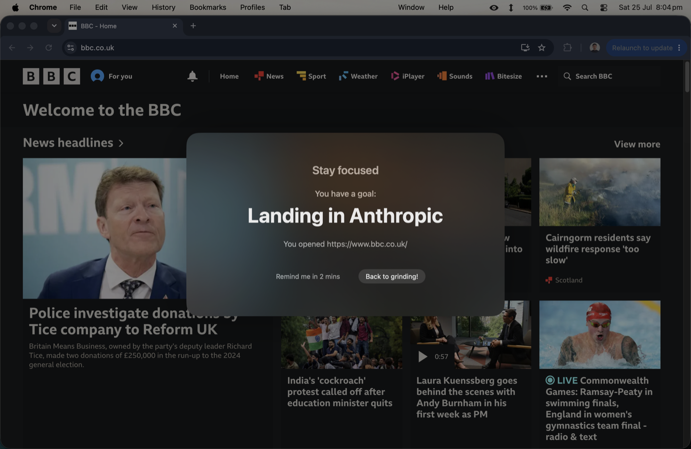
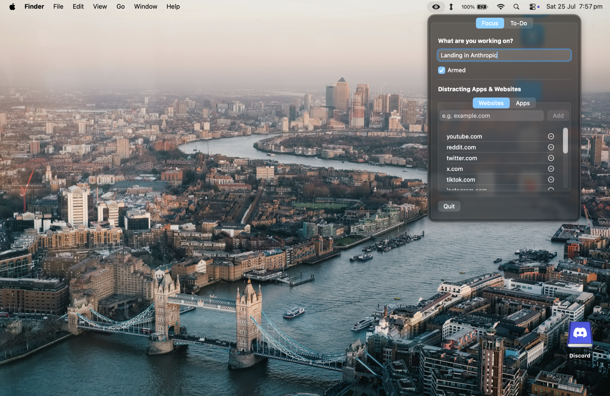
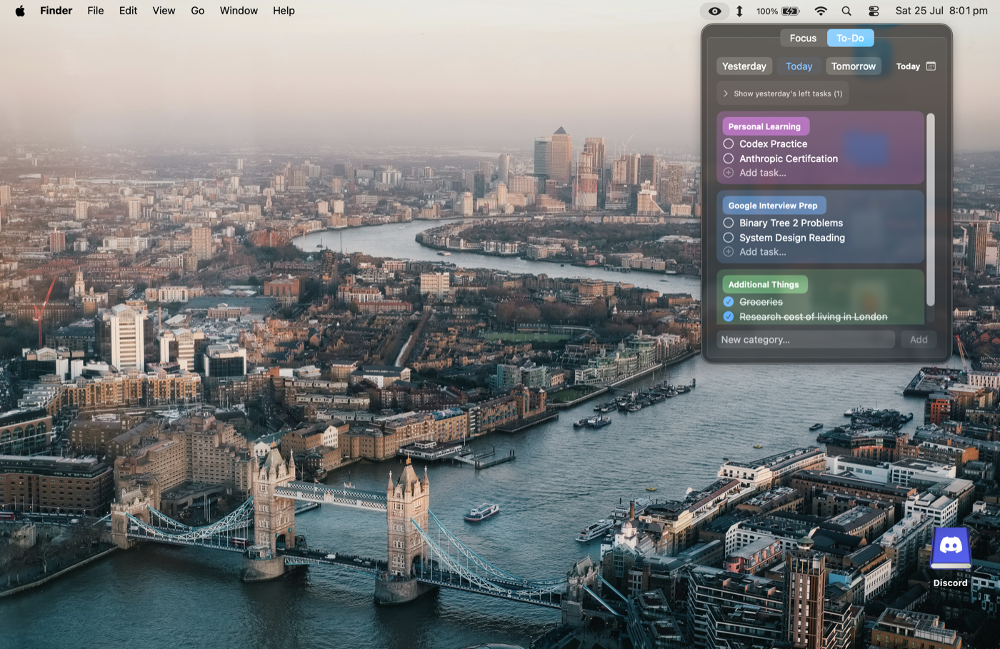

# Productivity Pack — Releases

A simple, native macOS app that lives in your top menu bar and boosts your productivity:

- **Focus** — set your goal, arm it, and get a gentle full-screen nudge when you drift
  to a distracting app or website (Chrome, Safari, Edge, Brave, Arc supported).
- **Manage your tasks** — fast day-based task list, easy to use, simple: Today /
  Yesterday / Tomorrow or any date, colored categories, drag to reprioritize.

Everything stays on your Mac — no accounts, no cloud, no tracking.

| Focus | To-Do |
|---|---|
|  |  |

**Requirements:** macOS 14 (Sonoma) or newer · Apple Silicon & Intel

## Install

1. Download the latest `ProductivityPack-vX.Y.Z.zip` from
   [**Releases**](../../releases/latest) and unzip it.
2. In Finder, drag **ProductivityPack.app** into your **Applications** folder yourself
   (a zip doesn't show the drag-to-Applications window — that's a DMG thing).
3. **Don't double-click it yet** — read the next section first.

## First launch (important!)

This is a test build that isn't notarized by Apple, so macOS blocks the first open.
This is expected — you only do this once:

1. Double-click **ProductivityPack.app** → a dialog says *"Apple could not verify…"*
   with only **Done** / **Move to Bin** → click **Done** (not "Move to Bin"!).
   Done looks like it does nothing, but it registers the app in System Settings.
2. Open **System Settings → Privacy & Security**, scroll down to
   *"ProductivityPack was blocked…"* → click **Open Anyway**
3. Confirm, enter your password if asked — the app opens, and normally from here on.

After launching, look for the **eye icon** in your menu bar (top-right of the screen).

## Permissions the app asks for

- **Automation** (System Settings → Privacy & Security → Automation): lets the app see
  your active browser tab's address so it can nudge you on distracting sites. The URL
  never leaves your machine.

## Feedback

Found a bug or have an idea? Message me directly, or open an issue here.
